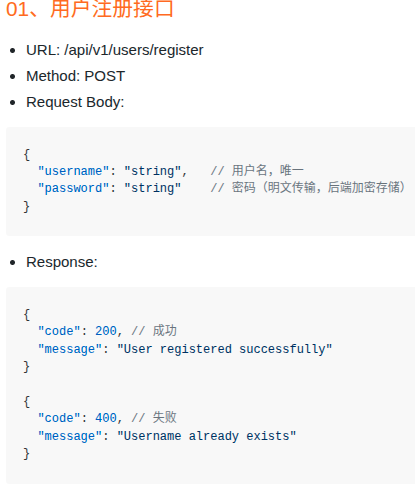
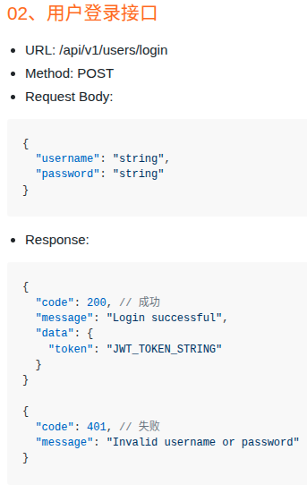
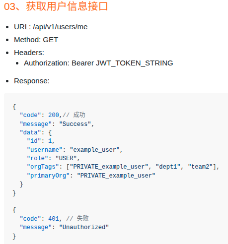
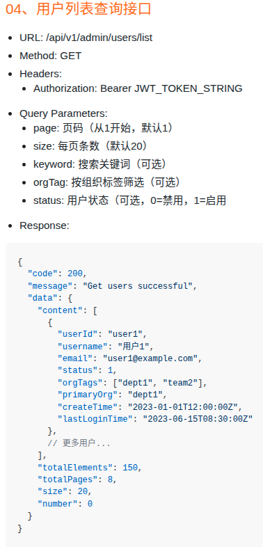

# 从0开始细化了解派聪明
## 用户管理模块
### 用户注册部分——表的设计及访问
#### 1.设计数据库表
- 用户表设计：
    - 字段有：id、username、password、role（角色，用于权限控制）、org_tags（组织标签）、primary_org(用户主组织标签)、created_at（创建时间）、updated_at（更新时间）
    - ```mysql
      CREATE TABLE users2 (
      id INT NOT NULL AUTO_INCREMENT PRIMARY KEY COMMENT '用户唯一标识',
      username VARCHAR(100) NOT NULL COMMENT '用户名，唯一标识',
      password VARCHAR(255) NOT NULL COMMENT '加密后的密码',
      role ENUM('USER','ADMIN') NOT NULL DEFAULT 'USER' COMMENT '用户角色',
      org_tags VARCHAR(255) DEFAULT NULL COMMENT '用户所属组织标签，多个使用逗号分隔',
      primary_org VARCHAR(50) DEFAULT NULL COMMENT '用户主组织标签',
      create_at TIMESTAMP DEFAULT CURRENT_TIMESTAMP COMMENT '创建时间',
      update_at TIMESTAMP DEFAULT CURRENT_TIMESTAMP ON UPDATE CURRENT_TIMESTAMP COMMENT '更新时间',
      UNIQUE INDEX idx_username(username)   
      ) ENGINE = InnoDB DEFAULT CHARSET = utf8mb4 COMMENT = '用户表';
      ```
    - Mysql书写注意：
        - 1.要有主键
        - 2.`ON UPDATE CURRENT_TIMESTAMP`表示执行了update语句，就会往这个字段刷新为现在时间、
        - 3.要建立索引`INDEX idx_username(username)`
##### 总结1：关于Mysql建表时的索引：
- 在建表的时候指定`INDEX idx_username(username)`可以给一个字段建立索引。
- 回表
    - 如果select要查找的列是非索引列就需要进行回表：在创建索引时，创建了索引的列的数据会存在B+tree中的叶子节点中，如果查找的数据是所找的索引树中没有的，就需要先索引找到主键，然后根据主键回表主键B+树，主键B+树是存了全部数据的，就可以找到select需要查找的数据。
- 索引覆盖
    - 只在一颗索引树上就能获取SQL所需数据，无需回表
        - 联合索引
            - 把需要查找的数据建立到联合索引：`INDEX nameAndsex (name,sex)`
- 唯一索引
    - 唯一索引是保证索引的字段的唯一性，如果是联合索引就保证联合字段的唯一性
    - UNIQUE添加到字段和索引上是一样的，添加到字段上mysql会给带有unique的字段自动创一个索引，所以推荐写到索引上，避免索引冗余
- 索引和数据是同步修改的，能保证数据的一致性
- 修改一个字段，会先更新主键树，如果是没有建立索引的字段就不用更新其他二级树，如果是建立索引的字段，其相关的二级树也要更新
- Change Buffer机制：更新一个普通索引时，如果这棵树正好在内存里，直接更新，如果不在Mysql会把更新操作记录存在Change Buffer上然后返回更新成功，等下次要查那个节点或者线程空闲的时候，Mysql才会将记录合并到真正的索引树里。
- 唯一索引不能使用Change Buffer
#### 2.创建java实体类
- 使用Lombok
    - 1.驼峰命名
- 1.Lombok的注解@Data怎么实现的？
	- 其依赖Java中的编译器注解处理机制，在Java编译的过程中，有一个过程叫注解处理（annotation processing），Lombok在这个阶段，通过自定义注解处理器（Annotation Processor）来动态修改抽象语法树（Abstract Syntax Tree），从而实现代码的自动生成。
	- JSR269规范：Lombok使用JSR269规范，为开发者提供了一种在编译器处理注解的标准方式，通过实现JSR269提供的Processor,Lombok可以实现自己的注解处理器，在编译期对原码的注解进行解析和处理。
		- 这就好比你是一个厨师，JSR 269 规范就像是一本烹饪手册，它告诉你如何使用各种烹饪工具（API）来处理食材（注解），而 Lombok 就是根据这本手册，创造出独特菜肴（生成代码）的大厨。
	- AST节点注入：在Java编译器解析原码时，会将源码转换为抽象语法树，树的节点是类、方法、变量等，LomBok注解处理器在编译期介入，根据@Data的注解规则，在树节点插入getter、setter、toString等方法。
		- 这就像是在搭建乐高积木的过程中，Lombok 在已有的积木结构（AST）上，添加了一些新的积木块（方法节点），最终搭建出一个完整的、功能丰富的模型（包含生成方法的类）。
	- 字节码生成：在Lombok完成对AST的修改后，Java编译器继续进行后续的编译步骤，包括语义分析和字节码生成
		- 这个过程就像是将设计好的蓝图（AST）转化为实际的建筑（字节码），让我们的代码能够在 JVM 上顺利运行。
- 2.LocalDatatime是什么类？
#### 3.数据访问层实现：
- 技术选型：Mybatis/Mybatis-Plus?还是SpringData JPA/Hibernate
- 使用的是SpringData JPA，底层由Hibernate驱动，为什么？
- JPA和Hibernate的各个注解含义：`@Entity、@Table、@Id、@GeneratedValue、@Column、@Enumerated、@CreationTimestamp、@UpdateTimestamp`
- 使用JPA+Hibernate+Lombok来写实体类，但数据访问层还没有实现，还需要：
    - 1.创建Repository接口，实现真正访问层
        - 继承JpaRepository就实现了插入，根据主键查询，删除，查询所有
        - 继承JpaRepository，尖括号里是泛型，第一个是处理的实体类，第二个是实体类的主键的类型
        - 新增方法时返回值写`Optional<User>`避免了空指针异常（想象成是一个快递盒子）
    - 2.告诉程序Mysql在哪（需要定义配置文件）
        - resources目录下的application.yml，配置spring:datasource和spring:jpa
#### 4.单元测试
@SpringBootTest、@Autowired注解原理
- 注册Bean
  - 只要是接口继承了JpaRepository，spring就会自动生成一个代理实现类并放入容器
  - 测试时的注意事项
    - 1.主启动类必须在最外层，业务代码在主启动类下级（这样主启动类才能扫描到）
#### 5.按照同样流程设计组织标签表
- 组织标签表设计
    - parent_tag依赖于表中的tag_id，tag_id被删除，parent_tag设置为null:
        - `FOREIGN KEY (parent_tag) REFERENCES organization_tags(tag_id) ON DELETE SET NULL;`
    - created_by依赖于users表中的id
        - `FOREIGN KEY (create_by) REFERENCES users(id)`
- 创建实体类
  - @Column注解里的(columnDefinition = "TEXT")什么意思？
    - JPA会默认把String映射为VARCHAR(255)，对于description来说，这不够，su指定SQL数据类型："TEXT"
  - @ManyToOne、@JoinColumn是什么意思？以及为什么要把createdBy对象定义为User？
    - @ManyToOne表示多对一，表示多个Tag可以对应一个User
    - JoinColumn定义外键列created_by
    - 类型是User是JPA拿到标签后自动连表查询出Users表的id
- 1.不熟悉mysql基础语法（建数据库、建表语法）
- 2.不熟悉JPA和Hibernate
- 3.不熟悉Lombok
- 4.软件包的作用？和文件夹的区别
- 5.Jpa怎么实现写一行代码就能写出对应的SQL，继承JPA时继承了哪些方法？
- 6.什么是泛型？
- 7.Spring测试原理（Spring扫描原理）
- 8.什么是ORM
- 9.什么时候进行单元测试？
  - 1.编写核心业务逻辑时
  - 2.修复线上bug时
  - 3.准备重构老代码时
  - 4.编写公共工具类时
- 10.Transactional注解是如何工作的？
- 11.@SpringBootApplication工作原理，为什么写了这个就能运行了
### 用户注册部分——注册服务
- 功能说明（来自技术文档）
  ```
  接收用户注册请求，验证用户名和密码；
  检查用户名是否已存在；
  使用 BCrypt 加密密码；
  创建用户记录，设置默认角色为USER;
  创建用户私人组织标签（PRIVATE_username）；
  将私人组织标签设置为用户的主组织标签；返回注册成功响应。
  ```
- 1.需要有默认组织标签
  - 为什么要有默认组织标签？
  - `Optional<User> adminUser = userRepository.findAll().stream()
    .filter(user -> User.Role.ADMIN.equals(user.getRole()))
    .findFirst();`这种是什么编程方法？
  - 新建系统管理员账户：
    - 设置随机密码，密码加密
    - 为什么要设置随机密码？
- 2.给密码加密
  - springsecurity的BCryptPasswordEncoder对密码进行加密以及验证是否匹配
- 3.创建用户组织标签
  - 程序好写，要养成写程序好习惯：
    - 定义名称，见名知意
    - 来个东西要判断是否为空
    - 写好日志
- 4.缓存组织标签信息
  - 为什么要缓存？
    - 用于缓存用户组织标签信息，提高权限验证效率
  - 缓存用户组织标签，组织标签列表来自哪里？
  - 这里不能定义一个方法了，要定义一个服务类来提供组织标签缓存服务
#### 组织标签缓存服务
- logger的info，debug,error分别用在哪里？
- 需要写一个配置类实现RedisTemplate<String,Object>，redis默认只创建RedisTemplate<Object, Object>和StringRedisTemplate (也就是 RedisTemplate<String, String>)
- RedisTemplate<String,Object>是存什么的，和RedisTemplate<Object, Object>有什么区别？
  - 本质区别在于：你打算以什么样的数据格式（尤其是KEY的格式）把数据存进Redis，以及底层使用的序列化器不同
  - RedisTemplate使用的是JDK序列化器，可视化不好
  - 自己重新写一个RedisTemplate可以指定序列化器，比如把Key序列化器换成StringRedisSerializer，Value换成GenericJackson2JsonRedisSerializer（json格式）
  - 大部分情况下key都是String，Value可以是List,可以是String，所以使用Object
##### 关于Redis配置类
- 1.@Configuration作用
- 2.RedisConnectionFactory类型
  - RedisConnectionFactory负责和远端的 Redis 服务器建立物理的 TCP 网络连接，并且维护一个“连接池”（避免每次操作都重新建立连接，提高性能）。
  - 在配置类里，RedisConnectionFactory作为参数传递，只进行了声明，是SpringBoot自动装配创建好的实例
- 3.RedisConnectionFactory底层原理是什么
- 4.RedisTemplate<String,Object>怎么来的，明明是定义的一个RedisConfig类，怎么变成了RedisTemplate<String,Object>
## 用户控制层（UserController）
`需要实现:
    用户注册接口
    用户登录接口
    获取用户信息接口
    用户列表查询接口
    组织标签管理接口`
### 01.用户注册接口

- 用到的注解：
  - @RestController
  - @RequestMapping("/api/v1/users")
  - @PostMapping
  - @RequestBody
- 问题：
  - 1.ResponseEntity是什么？
  - 2.monitor作用，为什么需要这个？
  - 3.==null和isEmpty区别？
  - 4.关于异常：什么时候要catch，需要catch什么异常？
  - 5.什么是MDC？
  - 6.Object... args是什么意思？
- 需要设计一个LogUtil类，用于提供统一的日志记录方法和格式
- 用户接口代码实现了，进行测试时请求进不来：
  - 因为引入了SpringSecurity，就锁死了项目中的全部接口（怎么实现的，原理是什么？）
  - 需要写一个SecurityConfig配置类
    - 1.SecurityConfig怎么写，里面要写些什么
    - 2.还需要写JWT认证过滤器和组织标签过滤器
- 为什么注册的时候不注入JWT token
### 用户注册接口完成总结
- 1.创建用户表及实体类
- 2.创建组织标签表及实体类
- 3.创建用户注册服务类
- 4.创建用户控制层，在里面实现用户注册接口
- 5.还写了CustomException异常类，密码加密工具类，日志记录工具类，Redis注解类，SpringSecurity配置类
### 02.用户登录接口

- 问题：
  - 1.什么时候用PostMapping，什么时候用GetMapping
- 1.实现登录验证
  - 用户名验证
  - 密码验证
- 2.把登录的用户信息存为JWT Token
  - 为什么要选择JWT呢?
  - JWT是什么，原理是什么
    - JWT（JSON Web Token）
  - 还有没有其他选择，是怎么选的
- UUID生成唯一ID的原理
- JWT的秘钥有什么用
- 为什么组织标签和主组织标签需要验证是否为空（目前看来这两个还没有变成空过）
- `String token = Jwts.builder()
  .setClaims(claims)
  .setSubject(username)
  .setExpiration(new Date(expireTime))
  .signWith(key, SignatureAlgorithm.HS256)
  .compact();`语法是怎样的，都拼接了些什么内容
- 写关于Redis缓存的程序时，要注意设计Redis的key的前缀
- 流程：登录成功后，jwtUtils对象接收到username进行token和refreshToken的生成，JwtUtils类负责生成token，然后调用TokenCacheService缓存类将tokenId作为key，userId,userName还有过期时间存到Map里作为value。然后接着将userId作为Key，将tokenId作为Value进行缓存。
  - refreshToken的生成和token的差不多，不过只存了userId、tokenId(设置成了null)和过期时间，过期时间为7天，token为1h，然后没有把refreshToken存到以userId为键的redis里
- 问题：refreshTokenId是做什么用的，和tokenId的区别
- 为什么refreshTokenId的Redis过期时间没有给5分钟缓冲
- Mysql是区分大小写检索的吗，为什么zhushihao的记录使用zhushiHAO可以查到
### 03.获取用户信息接口

- 1.怎么解析Jwt token？
  - 2.怎么验证jwt token?
- 异常，什么时候是用的CustomException,什么时候用Exception
### 04.用户列表查询接口(这个是管理员才能操作的)

- SecurityConfig里的`.requestMatchers("/api/v1/admin/**").hasRole("ADMIN"))`是怎么来过滤的
- 需要在SpringSecurity之前设置一个JWT过滤器
  - 1.需要创建一个将用户信息转为SpringSecurity所需UserDetails的转换格式类
  - 2.需要检查token是否有效
  - 3.检查token是否需要预刷新
  - 4.如果token过期是否可以刷新
  - 5.将新token返回给前端
  - 6.设置用户认证信息
  - 讲一下：设置用户认证信息和继续执行过滤链
- 需要了解一下SercurityConfig的配置
#### 分页流程
- 这里提供的源码在分页上存在问题：
  - 1.先拿到全部用户再过滤，可能导致OOM错误
  - 2.没有组织标签时，先分页再过滤，在逻辑上行不通（第一页2个数据，第二页3个）
- 新方案：在UserRepository里写一个动态查询，或者直接写@Query
  - 对于orgTag使用FIND_IN_SET
- 问题：怎么来判断哪种方案更好，对于不同方案要做哪些测试
  - 1.内存爆炸测试
  - 2.网络IO堵塞测试
  - 3.逻辑自洽测试
- 新方案存在的问题：
  - 1.索引失效
  - 2.FIND_IN_SET无非使用索引，为什么要用这个？因为表的设计在orgTags使用多个标签用逗号拼成字符串，查询时不友好
- 旧方案换成新方案接口响应时间RT(Resonse Time)从72ms到38ms
- JPA怎么把createdAt转为create_at
- 实际开发还需要盯住哪些指标？
  - JVM内存占用率、网络IO开销、CPU负载
  - 可以使用Prometheus+Grafana或者Arthas来监控
- 你是如何做技术选型和优化的？
  - 可以从背景->踩坑->优化->最终演进来回答
  - 在对系统的用户列表查询中，有一个问题：需要同时支持关键词模糊搜索和多标签过滤，并且要准确分页
  - 起初为了快速实现，采用了应用层过滤的方案，也就是先查全表或大批量数据，然后在java内存中用Stream流进行二次过滤，再手动截取List进行分页，但存在两个问题：
    - 1.内存泄漏与 OOM 风险：全表扫描极度消耗 JVM 内存。 
    - 2.分页逻辑断层：如果是先数据库分页，再拿到内存里过滤，会导致每页返回的数据量参差不齐，前端页码直接错乱。
  - 我决定把所有过滤和分页逻辑下推到数据库层。由于涉及动态条件，我利用了 Spring Data JPA 的 @Query 结合原生 SQL 进行优化。 
    - 1.利用 IS NULL OR ... 语法，一条 SQL 优雅地替代了 Java 里的层层 if-else，实现了动态参数拼接。 
    - 2.对于逗号拼接的标签，我利用 MySQL 的 FIND_IN_SET 函数进行精确匹配。
    - 优化成果：重构后，不仅解决了分页不准的 Bug，在 1 万条压测数据下，接口 RT（响应时间）降低了近 50%，同时彻底消除了 JVM 的内存溢出风险。”
  - 在 SQL 层使用 LIKE '%xxx%' 和 FIND_IN_SET 会导致MySQL 索引失效，引发全表扫描。
    - 如果未来系统数据量突破百万级，或者面对高并发场景，我会进行最终的技术选型（V3）：
    - 1.结构规范化：将标签字段拆分，建立独立的关联表（user_tag_relation），通过 JOIN 查询并加上联合索引。
    - 2.引入搜索引擎： 如果读请求极大，我会果断引入 Elasticsearch。通过监听 MySQL 的 Binlog（比如用 Canal）将数据同步到 ES，利用 ES 底层的倒排索引，将百万级数据的多维检索和模糊搜索耗时，彻底压榨到毫秒级。”
### 05.组织标签管理接口
#### 5.1创建组织标签（管理员）
.png)
- 1.为什么在控制层验证了是否为ADMIN，在服务层还要验证
- 2.还需要判断tagId是否已经存在，parentTag是否不存在
- 3.更新标签后要清楚用户标签缓存（层级可能发生了变化）
#### 5.2分配组织标签
- 1.分配组织标签是直接将新标签取代旧标签了，但还存在：1.用户私人标签如果有，不能被删，2.用户没有主组织标签，优先选择私人标签作为主组织标签，其次将新标签的首位作为主组织标签
### 5.3设置用户主组织
- 1.什么是有效组织标签
- 2.更新用户主组织的时候，为什么不是和分配组织标签一样先删后加，而是直接加
### 5.4获取用户组织标签详情
- 先从缓存获取组织标签和主标签
### 5.5组织标签树查询接口
- 是管理员看组织标签表里的全部标签（组织标签树）
- 通过递归实现
- Optional<OrganizationTag>是什么意思
### 5.6更新组织标签接口
- 在给一个属性赋值前要判断是否为空
- 对父标签进行判断复杂一点：1.判断父标签是否存在；2.判断赋值给父标签是否会造成环
### 5.7删除组织标签接口
- 需要判断该标签是否有主标签
- 需要判断是否有用户使用该标签
- 需要判断是否有文档使用该标签
# 文件上传解析
## 数据库设计
- 1.文件主表
  - 1.file_md5
  - 2.file_name
  - 3.total_size
  - 4.status:文件上传状态
  - 5.user_id：上传用户的标识符
  - 6.org_tag：文件所属组织标签
  - 7.is_public
  - 8.create_at
  - 9.merge_at：文件合并完成时间
- 2.分片表
  - 1.id分片记录唯一标识
  - 2.file_md5
  - 3.chunk_index分块序号
  - 4.chunk_md5分块的MD5值
  - 5.storage_path分块在存储系统中的路径
- 3.解析结果表
  - vector_id向量记录唯一标识
  - file_md5
  - chunk_id文件分块序号
  - text_content文本内容
  - model_version向量模型版本
  - user_id上传用户id
  - org_tag文件所属组织标签
  - is_public
- 创建实体类和接口
## 接口设计
### 分片上传接口：
    输入：
    Headers，fileMd5,chunkIndex,totalSize,fileName,totalChunks,orgTag,isPublic,file
    输出：
    已上传的分片索引
    进度
- 分片上传流程：
  - 
- @RequestAttribute是什么
- 1.设计文件类型验证服务类
- 2.设计文件上传服务
- 流程
  - 1.验证文件类型(对于第一个分片)：
    - 实现文件类型验证服务类、定义文件类型验证结果类型、从文件名提取后缀、从后缀提取文件名、验证文件名是否在集合里
  - 2.给orgTag初始化：orgTag不存在即赋值主标签
  - 3.uploadChunk方法实现
    - 1.查file_upload表，保证file_upload表中存在上传文件信息
    - 2.查redis，redis保存的是分片上传状态
    - 3.查chunk_info，chunk_info是存分片上传信息
    - 4.查MiniO是否存在文件，不存在redis也重新设置分片状态，然后重新上传
    - 5.保证chunk_info中存在分片上传信息
    - 分片的MD5值主要是作为redis和数据库的key来存值
    - uploadChunk没有返回值，上传的信息都存到redis,Mysql,MiniO中了
  - 4.获取已完成上传的分片索引列表
    - 怎么通过redis的bitmap获取已经上传的索引列表？
    - BitMap存储分片数据：
      - 比如存第10个分片，首先定位字节：10/8 = 1，在第二个字节(0,1),然后确定位置：10 mod 8 = 2，是从左到右的第3位，在bitmap的byte[1]里为00100000
      - 如何检查分片索引是否在在bitmap被设为1？
        - 首先定义数组的字节段，一个字节段有8个字节，然后确定字节位置：1 >> (7-chunkIndex%8)
- 问题：
  - 1.fileName == null || fileName.trim().isEmpty()为什么要验证这两个
  - 2.String的方法：lastIndexOf和substring
  - 3.file.getContentType();是返回什么
  - 4.对于原本继承JPA时没有继承来的方法，为什么仅在接口处定义了一个方法就能实现？
  - 5.什么时候要加@Transational注解，加了会对性能有影响吗
  - 6.minio的使用
  - 7.jedis?Redission?
### 查询上传状态接口
    输入：Header,fileMd5
    输出：total_chunks，已上传分片索引列表，进度
### 文件合并接口
- 开始总是各种验证：
  - 1.验证文件完整性
  - 2.验证是否有权限
  - 3.检查分片是否传完
- 然后是合并
  - 1.查询分片信息
  - 2.检查分片数量与实际总数是否一致
  - 3.将分片信息中的存储路径提取到List<String>
  - 4.检查每个分片在MiniIO中是否存在
    - `StatObjectResponse stat = minioClient.statObject(
      StatObjectArgs.builder()
      .bucket("uploads")
      .object(path)
      .build()
      );`
    - 1..builder()建造者模式，什么是建造者模式？StatObjectArgs.builder()
         .bucket("uploads")
         .object(path)
         .build()也就是说StatObjectArgs这个Args类里有bucket,object，使用builder进行赋值，可以把builder看成是标准填表流程
    - 2.除了StatObjectArgs，还有PutObjectArgs用于上传，GetObjectArgs用于下载，RemoveObjectArgs用于删除，逻辑是一样的：1.找到对应的Args类，2.通过builder赋值3.build封装4.把包交给minioClient执行
    - 3.statObject是MinIO客户端子啊底层发起一个HEAD请求，只返回响应头，没有响应体，用于判断文件是否存在
    - 4.返回的StatObjectResponse里有：.size()文件大小;.contentType文件的MIME类型;.lastModified()最后修改时间;.etag()文件的MD5值;.userMetadata()自定义标签
    - 5.statObject在文件不存在时会报错，使用时要用try catch包围
  - 5.合并分片
    - `minioClient.composeObject(
      ComposeObjectArgs.builder()
      .bucket("uploads")
      .object(mergedPath)
      .sources(sources)
      .build()
      );`
    - 1.使用composeObject方法，ComposeObjectArgs类，传递：bucket、object、sources，其中sources是ComposeSource的集合
    - 2.sources为：List<ComposeSource> sources = partPaths.stream()
      .map(path -> ComposeSource.builder().bucket("uploads").object(path).build())
      .collect(Collectors.toList());
    - 3.问题1.如果分片不全会合成成功吗？
  - 6.检查分片后的文件
    - 这个和第4步一样
  - 7.清理分片文件
    - 对于分片路径一个个调用removeObject，当然了对应的Args是removeObjectArgs
  - 8.删除Redis中的分片状态
  - 9.更新file_upload表
  - 10.生成预签名URL
    - `String presignedUrl = minioClient.getPresignedObjectUrl(
      GetPresignedObjectUrlArgs.builder()
      .method(Method.GET)
      .bucket("uploads")
      .object(mergedPath)
      .expiry(1, TimeUnit.HOURS) // 设置有效期为 1 小时
      .build()
      );`
    - 1.使用getPresignedObjectUrl方法，对应GetPresignedObjectUrlArgs类，builder里有method,bucket,object,expiry有效期
    - 2.method有四个方法：GET、PUT、HEAD、DELETE，是给拿到链接的人设置权限：分别对应下载、上传、获取元数据、删除
  - 为什么要选MinIO？还有哪些选择？
    - 1.StatObjectResponse stat = minioClient.statObject(
      StatObjectArgs.builder()
      .bucket("uploads")
      .object(path)
      .build()
- 怎么使用Kafka？
  - 1.引入Kafka依赖
  - 2.yaml配置Kafka
    - 1.Kafka地址
    - 2.Key和Value的序列化方式
  - 3.定义任务类
    - @AllArgsConstructor
      @NoArgsConstructor
  - 4.定义配置类
    - 1.加载配置
    - 2.定义KafkaTemplate，给KafkaTemplate传producerFactory
    - 3.producerFactory配置：
      - 1.生产者的服务地址
      - 2.生产者的Key和Value的序列化方式
      - 3.可靠投递配置
        - 1.ack_config
        - 2.幂等生产者配置：enable_idempotence_config
        - 3.重试次数:retries_config
        - 4.启用事务能力
  - 5.发送消息：`kafkaTemplate.executeInTransaction(kt -> {
    kt.send(kafkaConfig.getFileProcessingTopic(), task);
    return true;
    });`
    - executeInTransaction是一个模板方法，开启事务
    - 然后kt代表发送消息的工具人发送消息
### 文件删除接口
- 1.校验：
  - 校验文件组织标签与用户组织标签是否相等；校验文件是否存在
  - 文件是否上传完成：上传完成删MinIO，没上传完删分片MinIO和Redis
  - 还需要删除ElasticSearch中的记录，以及DocumentVector里面的记录